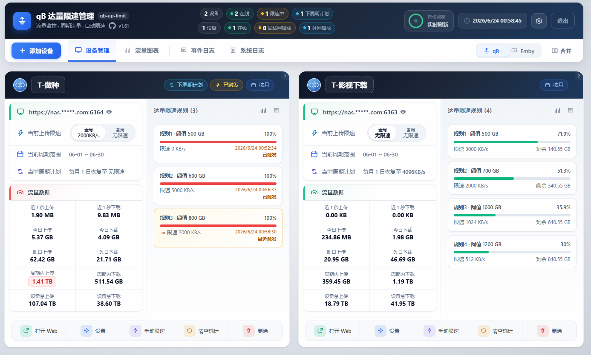
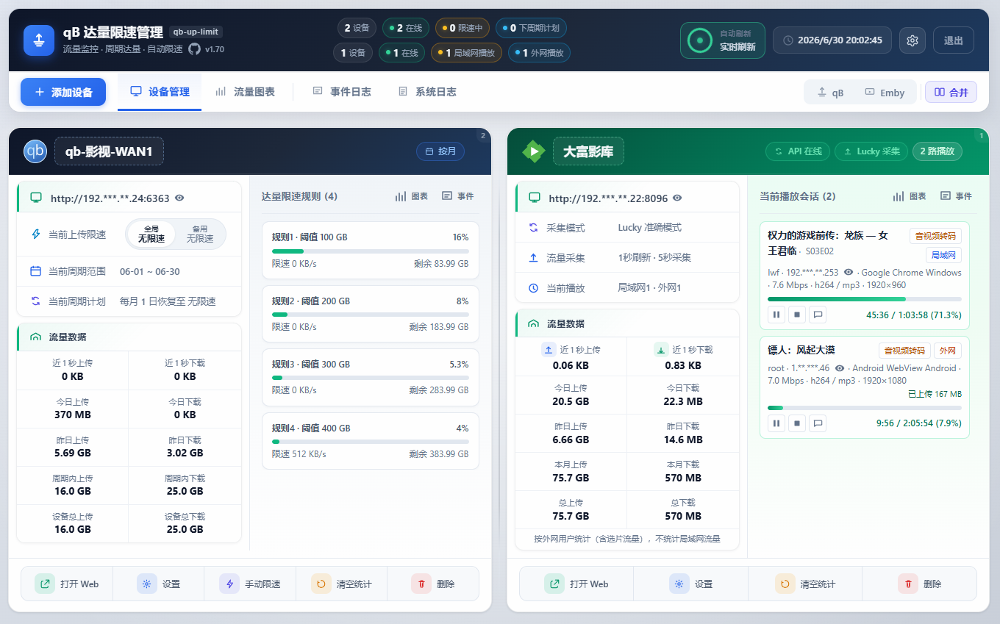
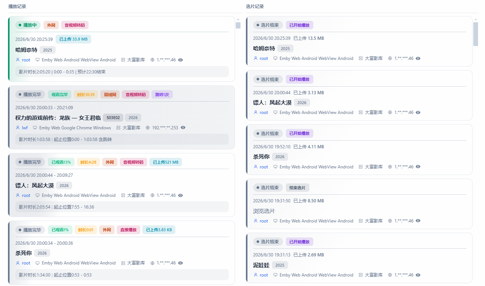

# qb-up-limit

# 核心功能

**qBittorrent-达量限速管理**

> 例：qb 每月上传达到 500GB 自动限速为 512KB/s，每月 1 日自动恢复至无限速

- 支持多台 qB 实例，实时监控上传/下载与在线状态
- 按周期（月 / 周 / 日）统计流量，支持多级达量规则
- 达量后自动设置全局上传限速；周期切换时按配置恢复
- 支持手动限速/解除、下周期计划、备用限速模式切换
- 流量图表、事件日志、系统日志；数据本地 SQLite 持久化



---

### Emby 功能（可选）：

>Emby 流量统计（Lucky 反代模式）
>
>本程序的核心目标，是按 Emby 用户 统计其外网访问产生的真实上传流量。
>
>Lucky 反向代理提供 连接级 流量统计，并可通过 API 获取每条连接的流量数据；Emby 则提供用户、会话、播放状态等信息。程序将两路 API 数据结合，通过裁决算法判断：某条 Lucky 连接应归属哪位用户。
>
>裁决时主要依据 IP、建连时间、会话状态、流量形态 等信息进行匹配与归属；匹配成功后，再结合 Emby 侧的 客户端、设备 等信息，形成该用户下的会话归属键，用于区分同一用户的不同设备或会话。当用户处于选片、浏览等非播放状态时，产生的流量记为 选片流量；当用户开始播放后，流量则累计到对应的 播放段会话。由此实现按用户分别记录选片流量与播放流量。

---


- 与 qB 设备视图可独立或**合并展示**（qB / Emby / 合并三种视图）
- 实时播放会话：区分局域网与外网播放
- 外网流量采集两种模式选择，建议Lucky 反代模式：
  - **Lucky 反代模式**：结合 Lucky 与 Emby API，准确采集外网流量，并推断选片流量
  - **Docker 模式**：基于容器网卡统计 + 根据算法估算外网上行，不保证准确率
- 播放记录、选片记录、活动日志；用户维度统计与图表
- 外网 IP 脱敏显示；进入调试面板（地址栏加`?emby_debug=1`）



**展示完整信息的播放记录、选片记录，按用户会话统计上传流量**

- 需结合 **Lucky反代**，达到准确采集流量
- 根据 播放进度 动态渐变卡片背景色
- 用户选片时（浏览海报/元数据）产生的选片流量也可计入对应用户



---

### Web 管理

- 浏览器访问，账号登录；实例与全局配置可在界面完成
- 移动端适配

#### 访问方式

浏览器打开：`http://<主机IP>:8765`

**默认 Web 账号**（首次启动自动生成，请及时修改）：

| 用户名  | 密码         |
| ------- | ------------ |
| `admin` | `adminadmin` |


**以及图表统计功能，图略...**


## 下版本计划
利用 **Lucky API** 已实现 Emby 流量的准确采集，接下来准备做 Emby 的「达量限速」功能~


## 快速开始（Docker Compose）

**Docker 部署**：

```bash
services:
  qb-up-limit:
    image: luowenfu/qb-up-limit:latest
    container_name: qb-up-limit
    restart: unless-stopped
    network_mode: host
    environment:
      TZ: Asia/Shanghai
    volumes:
      - ./data:/data
```


## 安全提示（开源 / 部署前必读）

以下内容**切勿**提交到公开仓库或分享给他人：

- `data/config.yaml`
- `data/.qb_secrets`、`data/.emby_secrets`
- `data/.web_auth`、`data/.web_secret`、`data/.data_key`
- `data/*.db`、`data/app.log*`、`data/emby_events/`


> 本开源项目仅供学习测试

## 许可证

[MIT](LICENSE)

## 致谢

- [qbittorrent-api](https://github.com/rmartin16/qbittorrent-api)
- [Flask](https://flask.palletsprojects.com/)
